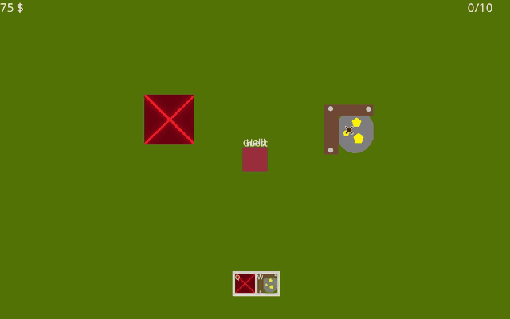

# Kings



Kings is a small top-down multiplayer building game written in C++ with SFML. You play as a square that keeps walking
towards your mouse cursor, and you grow your kingdom by placing buildings on the map: press `Q` for a **Home**, which
raises your soldier capacity, or `W` for a **Mine**, which earns you money every second, then left-click to place it
(buildings can't be placed too close to each other). One player picks **Create Game** to host, and the others pick
**Join Game** and add the host's IP in the server list. Everyone sees each other's movement and buildings in real
time. `Esc` opens the options menu, where you can disconnect or close the game.

## Architecture
- **Listen server on its own thread:** *Create Game* starts a `Server` (an ENet host on port 7777) on a background
  `std::thread` (`Self::BecomeServer`). The host then connects to it over localhost as a normal `Client`, so the host
  and the other players run the same client code. The server keeps a copy of every player (name, position and
  buildings) so it can send the current state to players who join later. Gameplay packets (moves, new buildings,
  chat) are relayed to the other clients. The server thread only touches `Server` state; drawing and input stay on the main thread.
- **ENet + cereal:** [ENet](lib/enet) handles the UDP connections and reliable delivery. Every message is a
  `Packet<T>` (`src/Network/Packet.h`) holding a type (`Join`, `Leave`, `Move`, `CreateHome`, `CreateMine`, `Chat`),
  the sender's id and the data. These are turned into bytes with [cereal](lib/cereal) binary archives by
  `Serializator` (`src/Core/Serializator.h`), which also has the serialize functions for the SFML types we send.
- **Scene/layer system:** `SceneManager` holds the scenes (`Main`, `Game`, `Server List`) and which one is active. A
  `Scene` is an ordered list of `Layer`s; each layer has its own `sf::View` and a list of `Entity`s (players, buildings,
  buttons...). Events go from the top layer down and stop at the first entity that handles them, while drawing goes
  from the bottom layer up. For example, the `Game` scene has a `UI` layer over the `Game` layer, and pop-ups like the
  options menu are added as a new layer at priority 1 so they are drawn on top and get input first.

```
src/
├── Core/      Application, scenes and layers, serialization, texture and random helpers
├── Entities/  Player, Self (the local player) and buildings (Home, Mine)
├── Network/   ENet client and server, packet definitions
└── UI/        Buttons, text inputs, server list, shop bar, options menu
```

## How to build
Note: this build needs an internet connection to download SFML and TGUI.
### - Windows
#### Using Ninja
If you run the `build/build-windows-ninja.bat` file, it will automatically build the project.
But this bat file requires cmake and ninja.
> build/build-windows-ninja.bat debug

This will build the project in debug mode.
If you do not specify the mode it will automatically be release mode.
#### Using Visual Studio
If you run the `build/build-windows-vs.bat` file, it will automatically build the solution file.
But this bat file requires cmake and Visual Studio 2022.
> build/build-windows-vs.bat debug

This command will automatically open Visual Studio, and you have to follow some instructions:
- Right-click the `Kings` project in the Solution Explorer
- Choose ``Set as Startup Project``

This will build the project in debug mode.
If you do not specify the mode it will automatically be release mode.

### - Linux
If you run the `build/build-linux-ninja.sh` script, it will automatically build the project.
But this script requires cmake and ninja. If you do not want to build with ninja, you can change the generator in the
script.
> build/build-linux-ninja.sh debug

This will build the project in debug mode.
If you do not specify the mode it will automatically be release mode.

## FAQ
### Can not access the assets folder
You probably did not set the working directory in your IDE. It has to be the project root (the folder that contains
`assets/`), because the game loads its fonts and images from relative paths.
